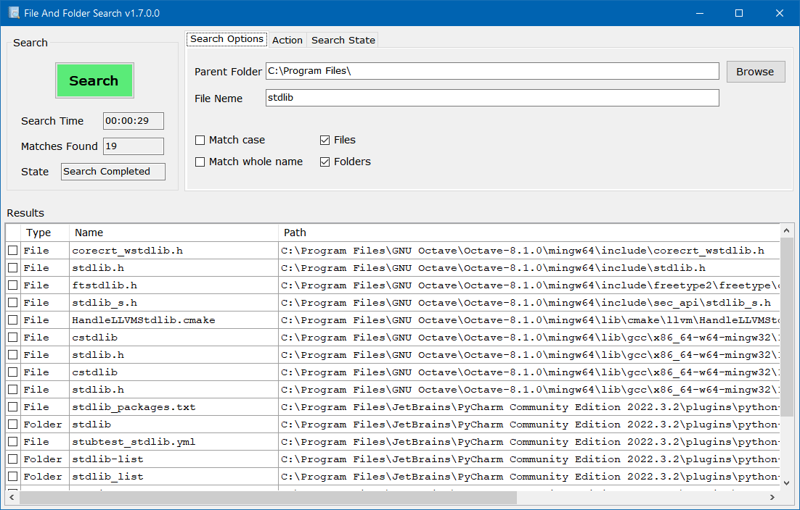

# File and Folder Search

### A Windows app that searches for files and folders.

The search is done on folders and subfolders witout recuosion, instead I use an iterative approuce and a quequ to handle the subfolders in each folder.
I worte this as a self execise after arguing with a fellow student how isisted the only way to search a file system is with recousion. Along the years I added features an improvements.

The app is a WinForms application written in C# .NET.
